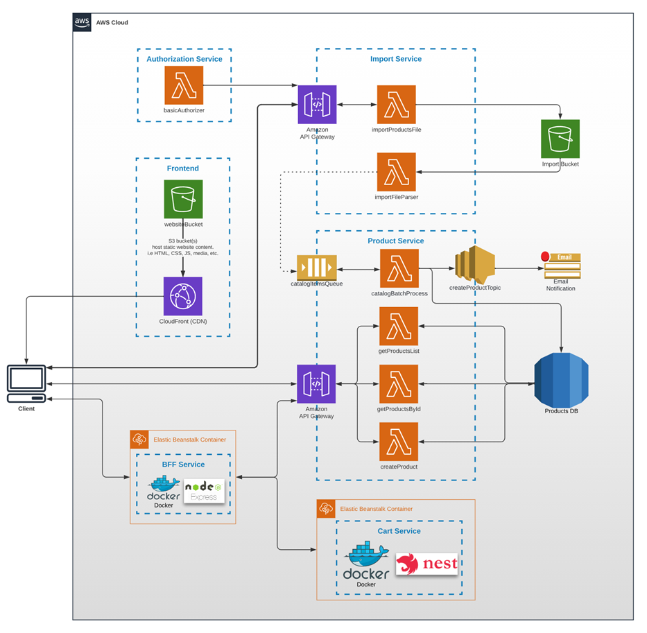

# AWS Cloud Project – Serverless Web Architecture & Integration

This project is a hands-on exploration of modern cloud architecture using AWS services, covering everything from fundamental cloud concepts to advanced serverless integrations. The work was completed as part of a structured 10-module learning program and focuses on building scalable, maintainable web applications using cloud-native technologies.

This project covers a wide range of cloud-related topics, following the architecture illustrated in the diagram below:

## 📚 Modules Overview

### **1. Introduction to Cloud Computing**

* Learned the basics of cloud technology, including service models (IaaS, PaaS, SaaS) and deployment models (public, private, hybrid).
* Explored application architectures: monolithic, microservices, and serverless.
* Hands-on experience with AWS account setup, IAM (Identity and Access Management), and monitoring using CloudWatch.

### **2. Publishing SPA (Single Page Applications)**

* Hosted static web applications using Amazon S3 and distributed them via CloudFront.
* Introduction to AWS CLI for deployment automation.

### **3. Serverless API Development**

* Built APIs using AWS Lambda.
* Implemented logging and monitoring via CloudWatch.
* Explored advanced Lambda configurations.

### **4. Integration with NoSQL (DynamoDB)**

* Used AWS DynamoDB to store and retrieve data in a scalable, serverless way.

### **5. Advanced S3 Integration**

* Worked with S3 storage classes, access control, encryption, versioning, and lifecycle management.
* Integrated Lambda functions to process S3 events.

### **6. Asynchronous Microservices Communication**

* Implemented asynchronous workflows using AWS SQS and SNS.
* Integrated these services with Lambda for event-driven architecture.

### **7. Authorization & Authentication**

* Learned authentication and authorization using API Gateway and Lambda Authorizers.
* Integrated AWS Cognito for user and identity pool management.

### **8. SQL Database Integration**

* Introduction to relational databases and SQL syntax.
* Connected serverless functions to AWS RDS (MySQL/PostgreSQL engines).

### **9. Containerization**

* Built and optimized Docker images using Dockerfiles.
* Understood container vs virtual machine concepts.
* Deployed containers using AWS Elastic Beanstalk and EB CLI.

### **10. Backend for Frontend (BFF) Pattern**

* Implemented BFF architecture using API Gateway as a frontend-facing layer.
* Configured Elastic Beanstalk environments to support frontend-backend separation.

## 🚀 Technologies Used

* **AWS Services:** Lambda, S3, DynamoDB, RDS, IAM, Cognito, API Gateway, CloudFront, CloudWatch, SQS, SNS, Elastic Beanstalk
* **Tools:** AWS CLI, EB CLI, Docker
* **Languages:** JavaScript / Python (or depending on actual implementation)

## 📦 Structure & Deployment

Each module can be found in its respective folder with related resources and deployment scripts (if applicable). Automation and infrastructure-as-code principles were used where possible for reproducibility and scalability.